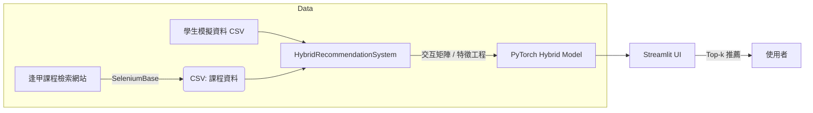

# 智慧課程推薦系統與課程爬取工具

> SeleniumBase + Streamlit + PyTorch 混合式課程推薦範例專案
>
> *作者：向宇翔 Hsiang Yu-Hsiang*

---

## 目錄

1. [專案簡介](#專案簡介)
2. [功能特色](#功能特色)
3. [流程架構](#流程架構)
4. [快速開始](#快速開始)
5. [安裝與環境設定](#安裝與環境設定)
6. [執行步驟](#執行步驟)
7. [資料格式說明](#資料格式說明)
8. [目錄結構](#目錄結構)
9. [常見問題](#常見問題)
10. [貢獻指南](#貢獻指南)

---

## 專案簡介

本專案示範如何：

1. 透過 **SeleniumBase** 自動化爬取逢甲大學課程檢索網站，並將課程資訊匯出為 `CSV`。
2. 使用 **Streamlit** 搭配 **PyTorch** 架構一套 *Hybrid*（協同過濾 + 內容過濾）課程推薦系統。
3. 提供互動式 UI 與資料視覺化，讓使用者能上傳/瀏覽資料、訓練模型並取得個人化推薦。

> 目標使用情境：校內選課諮詢平台、學習歷程分析、AI 驅動的課程建議服務。

---

## 功能特色

| 模組            | 特色                                   | 檔案                            |
| ------------- | ------------------------------------ | ----------------------------- |
| **課程爬取**      | CLI 互動選單（學制→學院→系所→班級）<br>自動跨分頁擷取課程描述 | `SeleniumBase/test.py`        |
| **資料前處理**     | SBERT 文本向量化、特徵標準化、交互矩陣建構             | `main_vison.py`               |
| **協同過濾 (CF)** | 學生/課程 Embedding + MLP                | `CollaborativeFilteringModel` |
| **內容過濾 (CB)** | 學生 4 維 + 課程 768 維語意向量 → MLP          | `ContentBasedModel`           |
| **Hybrid 融合** | 可學習 α、β 權重 + 2nd-stage Fusion        | `HybridModel`                 |
| **UI / 視覺化**  | Streamlit 分頁、Plotly 圖表、推薦卡片          | `main_vison.py`               |

---

## 流程架構



---

## Demo 示範

以下影片展示整個系統從 **課程爬取→模型訓練→推薦產出** 的操作流程，建議先觀看一遍再依指令操作。


<video src="https://github.com/seannnnnn1017/fcu-hybrid-course-recommendation/blob/main/DEMO.mp4" controls style="max-width:100%; height:auto;">
  您的瀏覽器不支援 HTML5 video tag。
</video>


---

## 快速開始

```bash
# 1. 下載專案
$ git clone https://github.com/your‑repo/course‑rec‑demo.git
$ cd course‑rec‑demo

# 2. 建立虛擬環境（建議）
$ conda create -n courseRec python=3.10
$ conda activate courseRec

# 3. 安裝依賴
$ pip install -r requirements.txt

# 4. 先爬課程資料（可跳過，使用範例 CSV）
$ python SeleniumBase/test.py  # 依指示選單操作

# 5. 啟動推薦系統
$ streamlit run main_vison.py
```

開啟瀏覽器 [http://localhost:8501](http://localhost:8501)，依 UI 指示：

1. 上傳課程 CSV / 學生 CSV。
2. 點擊 **開始訓練模型**。
3. 選擇某位學生 → **生成推薦**。

---

## 安裝與環境設定

| 主要套件                  | 版本建議               |
| --------------------- | ------------------ |
| Python                | ≥ 3.9              |
| SeleniumBase          | ≥ 4.21             |
| Streamlit             | ≥ 1.33             |
| PyTorch               | ≥ 2.2（含 CUDA 運算建議） |
| sentence‑transformers | ≥ 2.6              |
| Plotly                | ≥ 5.20             |

完整相依請見 `requirements.txt`。

> **Tip**：如在 M1/M2 Mac 或 GPU 環境安裝 PyTorch，請參考官方對應 CUDA / Metal Wheel。

---

## 執行步驟

### A. 課程爬取

1. 執行 `python SeleniumBase/test.py`。
2. 依終端機提示依序選擇：學制 → 學院 → 系所 → 班級。
3. 選擇欲爬取的筆數（Enter = 全部）。
4. 完成後輸出 `課程資料_YYYYMMDD_HHMMSS.csv`。 

### B. 模型訓練

1. 於 Streamlit UI 上傳課程 CSV 與學生 CSV。
2. 調整 `Top‑k` 推薦數（預設 10）。
3. 點擊 **開始訓練模型**，待進度條完成。

### C. 生成推薦

1. 選擇學生 ID（UI 會同步顯示年級/GPA）。
2. 按 **生成推薦**，系統即刻列出課程卡片與信心度。
3. 可查看推薦分數分布與統計摘要。

---

## 資料格式說明

### 課程資料（`courses.csv`）

| 欄位   | 型別  | 範例          |
| ---- | --- | ----------- |
| 課程編碼 | str | CS101       |
| 課程名稱 | str | 程式設計一       |
| 課程描述 | str | 本課程介紹...    |
| 學分   | int | 3           |
| 必選修  | str | 必修 / 選修     |
| 上課方式 | str | 課堂教學 / 線上教學 |

### 學生資料（`students.csv`）

| 欄位              | 型別         | 範例                    |
| --------------- | ---------- | --------------------- |
| student\_id     | str        | S20250001             |
| grade\_level    | int        | 2                     |
| gpa             | float      | 3.75                  |
| total\_credits  | int        | 68                    |
| passed\_courses | list\[str] | \['CS101', 'MATH201'] |

> **注意：** `passed_courses` 必須是 *Python list 字串*，如 `['CS101','EE120']`。

---

## 目錄結構

```txt
├── SeleniumBase/
│   └── test.py           # 課程爬取腳本
├── main_vison.py         # Streamlit 推薦系統
├── requirements.txt
├── README.md             # 本文件
└── sample_data/
    ├── courses_demo.csv
    └── students_demo.csv
```

---

## 常見問題

| 問題                        | 解法                                         |
| ------------------------- | ------------------------------------------ |
| **SeleniumBase 無法開啟瀏覽器？** | 確認已安裝對應版本的 Chrome / Edge，或加 `--uc` 參數避開驗證。 |
| **SBERT 下載緩慢？**           | 先行 `huggingface-cli login` 或手動下載模型至本地快取。   |
| **CUDA 記憶體不足？**           | 調降 `batch_size`，或改用 CPU 推論（速度較慢）。          |

---

## 貢獻指南

1. Fork → 新分支 → 提 PR。
2. PR 需說明動機、變更內容、測試結果。
3. 遵守 [Pre‑Commit](https://pre-commit.com/) & PEP 8 風格；請附至少一項單元測試。

---


> *希望此專案能協助您快速體驗「爬取 → 特徵工程 → 深度推薦」的完整流程，若有問題或建議，歡迎提 Issue！*
